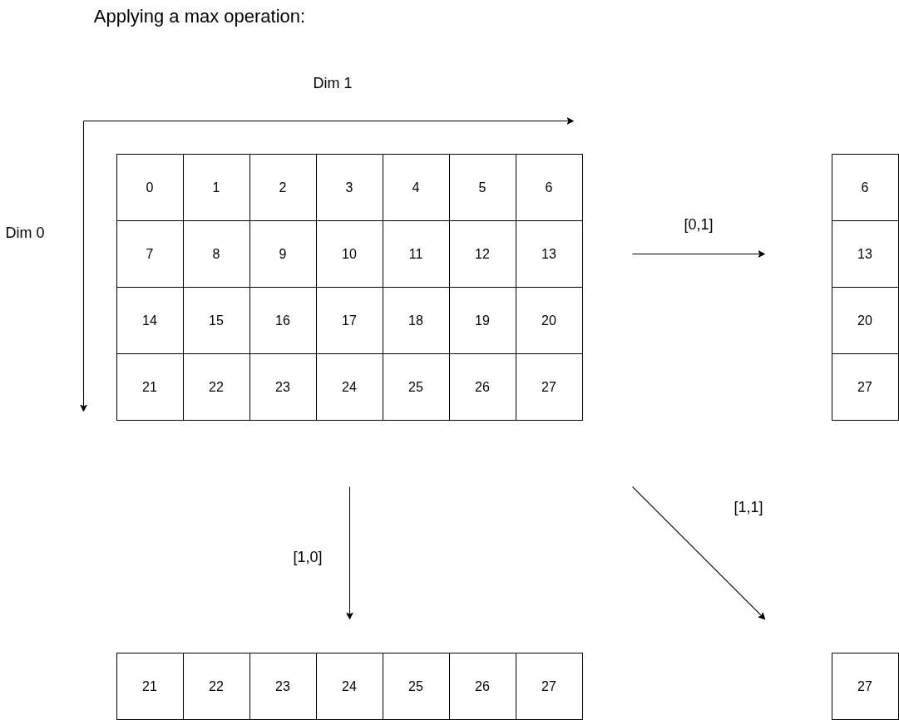

# Active Storage

[](https://github.com/7schroet/activeStorage/actions/workflows/tests.yaml)


Enabling in-situ data analysis operations by combining a file-system-agnostic Active Storage client/server
architecture with an HDF5 VOL plugin.

## Usage

The `as-rpc` library contains the functionality for both client and server. The server executable, `as-server` must be started ahead of time.

```
$> as-server --help
Start the Active Storage server.
Usage:
        --help:                 Print this message
        --protocol:             Pick a protocol (tcp[default],verbs)
        --port:                 Pick a port (default: 8080)
        --addressfile:          Path to the file that contains the server's address (default: ./servername)
```

The server will write an address file that contains relevant information to connect subsequent clients. For an example custom client, refer
to the `as-client` executable, which uses the Active Storage server to calculate a mean over some sample data.

```
$> as-client --help
Start the Active Storage client.
Usage:
        --help:                 Print this message
        --protocol:             Pick a protocol (tcp[default],verbs)
        --addressfile:          Path to the file that contains the server's address (default: ./servername)
        --output:               Path to the output file (default: ./out.h5)
        --rpc-output:           Path to the RPC output file (default: ./rpc_out.h5)
        --random:               Add random numbers in [0,1) to the written data
        --mean:                 Choose which dimensions to calculate the mean over (default: "111")
                                The input is always 3 digits (0 to keep the dimension, 1 to reduce it)
        --type:                 Data type for written data (double[default], int, float)
```

This project also provides another client, embedded into an HDF5 plugin. This provides an opportunity for transparent and easy-to-use in-situ data
analysis, and is the intended way to use this project.

## Dependencies

All dependencies can be built via spack.

### Required

- [Thallium](https://github.com/mochi-hpc/mochi-thallium)
- [HDF5](https://github.com/HDFGroup/hdf5)

### Optional

- [GoogleTest](https://github.com/google/googletest)

## Building

Execute the following commands to build:

```sh
mkdir build
cd build
cmake .. <your options here>
make && make install
```

This will build all the components with the default build type (`Release`) and install
the components into `${CMAKE_CURRENT_SOURCE_DIR}/install`. Tests can be enabled by
setting the option `-DENABLE_TESTS=ON`. Run them via `ctest` after `make`.

For an overview of all available CMake options, run `cmake -LH`.

## Using the HDF5 plugin

An Active Storage client is available in an HDF5 [VOL plugin](https://support.hdfgroup.org/documentation/hdf5/latest/_h5_v_l__u_g.html).
As such, you only need to set a few environment variables whenever you want to use the Active Storage with your HDF5 application for in-situ
data analysis. After building the plugin, set:

```sh
# these are for HDF5 in general
export HDF5_USE_FILE_LOCKING=FALSE
export HDF5_PLUGIN_PATH=<path/to/dir/with/plugin>
export HDF5_VOL_CONNECTOR="as-rpc-hdf5 under_vol=0;under_info={};"
# these are specific to the plugin
export AS_RPC_SERVER_ADDRESS=</path/to/servername/file> # written by the server on startup
export AS_RPC_OPERATIONS=</path/to/config/toml>
```

Now all HDF5 calls will go through this connector. The plugin is built as a pass-through connector. This means that all
your HDF5 calls will behave as they normally do (i.e., write calls will still write the data), but some functions also invoke
`as-rpc` calls to calculate statistics in-situ in a transparent manner. There is also a second connector that does not write the
files anymore and instead transfers the data directly to the server. If you want to use that plugin, adjust the
`HDF5_VOL_CONNECTOR` variable and use `as-rpc-hdf5-bulk` instead of `as-rpc-hdf5`.

## Configuring the Data Analysis Operations

The data analysis operations are controlled by a simple config file that the plugin needs to be aware of, namely by setting
the previously mentioned `AS_RPC_OPERATIONS` variable. The config file is written in the [TOML format](https://toml.io/en/).
Here is an example:

```toml
[[operations]]
type = "mean"
dims = [0,1,1]
infile = "/absolute/path/to/input.h5"
dset = "dsetName1"
outfile = "/absolute/path/to/outmean.h5"

[[operations]]
type = "max"
dims = [1,1,1]
infile = "/absolute/path/to/input.h5"
dset = "dsetName2"
outfile = "/absolute/path/to/outmax.h5"
```

Each operation starts with `[[operations]]`. The `type` key is used to define the reduction operation that should be applied, i.e., a maximum.
The input file that your application will write needs to be passed to the `infile` key. Make sure to only use absolute paths! The relevant data set
name is defined in the `dset` key. The result of the data analysis is stored in a separate file, defined in `outfile`. Make sure that this file
does not exist, and that each operation has its own output file! Lastly, the `dims` key: this is an array containing only 0's and 1's. This defines
along which dimensions the reduction is applied. The number of entries in this array must match the dimensions of the input data set.
If the entry for a corresponding dimension is 1, that dimension will be reduced in the operation. 0 means that the dimension will be left as-is.
The following image illustrates this further.



If you want to ensure that your config file is correct ahead of time, you can pass the file as an argument to the `as-rpc-config-validate`
executable. Currently, these are the available reduction operations:

- mean
- min
- max

## Server Setup

The server can run multiple threads at once to serve RPCs by making use of Argobot's threading capabilities. By default, the server runs on a
single OS thread. If you want more, set the environment variable `AS_SERVER_THREADS` to the desired value before starting the server. Make sure to
build the server with thread-safe HDF5 if you do so!

## Development

### Pre-commit

To keep license information and formatting consistent, we use
pre-commit. Install pre-commit as such:

```sh
python3 -m pip install pre-commit
```

Then run the following command in the root of this repository:

```sh
pre-commit install
```
